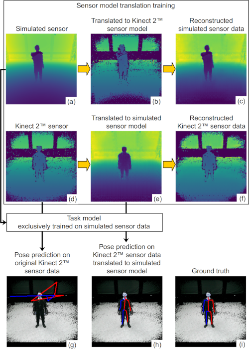

# Sensor model translation (SMT)

This repository contains the source code for our sensor model translation from simulated to real Kinect 2 TM depth data that is developed at [Cognitive Systems Group](https://cogsys.reutlingen-university.de/), Reutlingen University. Our dataset is also available for [download](https://cogsys.reutlingen-university.de/pub/files/3DV2019/smt_dataset.zip).
For human pose estimation we use our own implementation of a [Stacked Hourglass Network](https://arxiv.org/abs/1603.06937).



The model learns to translate between the simulated and Kinect 2 TM sensor. The original depth data (a and d) is translated to the other sensor model (b and e). As we build our sensor model translation upon [TD-GAN](https://arxiv.org/abs/1806.07201), which in turn is based on [CycleGAN](https://github.com/junyanz/CycleGAN), we also use a cycle consistency loss. Therefore, the original data is reconstructed from the translated data again by applying the opposite translation direction, respectively (c and f). The subfigures (g), (h) and (i) show the task model’s prediction on the original Kinect 2 TM data, on Kinect 2 TM data with sensor model translation
and the corresponding GT.


Left: The task model's prediction on Kinect 2 TM depth data. The task model has been trained on simulated depth data only.  
Middle: The task model's prediction on Kinect 2 TM depth data with sensor model translation (Kinect 2 TM depth data translated to simulated sensor model). The task model has been trained on simulated depth data only.  
Right: The task model's prediction on Kinect 2 TM depth data. This time the task model has been trained on real Kinect 2 TM data only.

## Requirements:
Tested with Ubuntu 18.04, TensorFlow 1.12 and Keras 2.2.4.

### apt:
* python2
* python2-tk
* GraphViz

### pip:
* tensorflow-gpu
* keras
* pydot
* matplotlib
* opencv-python

## Project Structure
```
sensor-model-translation
 \--stacked_hourglass_network
    Package with Stacked Hourglass Network
    implementation for human pose estimation.
 \--sensor_model_translation
    Package with our sensor model translation implementation.
    Two data samples (real and sim) are provided in data_samples_for_prediction
    for predict.py and predict_with_smt.py if you just want to try the prediction.
```
## Citation
Please cite our work as

M. Essich, D. Ludl, T. Gulde and C. Curio, "Learning to Translate Between Real World and Simulated 3D Sensors While Transferring Task Models", 2019 Seventh International Conference on 3D Vision (3DV), Sept. 2019

```
@InProceedings{Essich2019,
  author    = {Michael Essich and Dennis Ludl and Thomas Gulde and Cristóbal Curio},
  title     = {Learning to Translate Between Real World and Simulated 3D Sensors While Transferring Task Models},
  booktitle = {2019 Seventh International Conference on 3D Vision (3DV)},
  year      = {2019},
  month     = {9},
}
```
